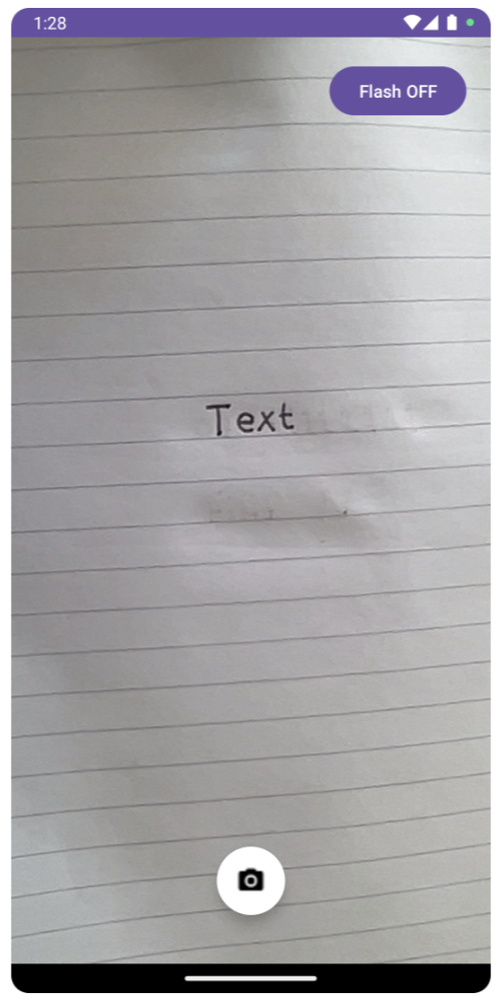
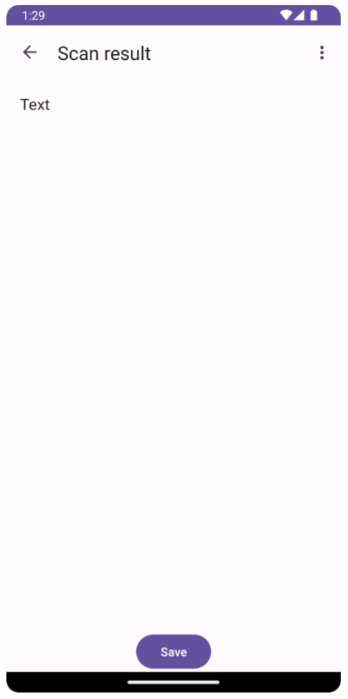
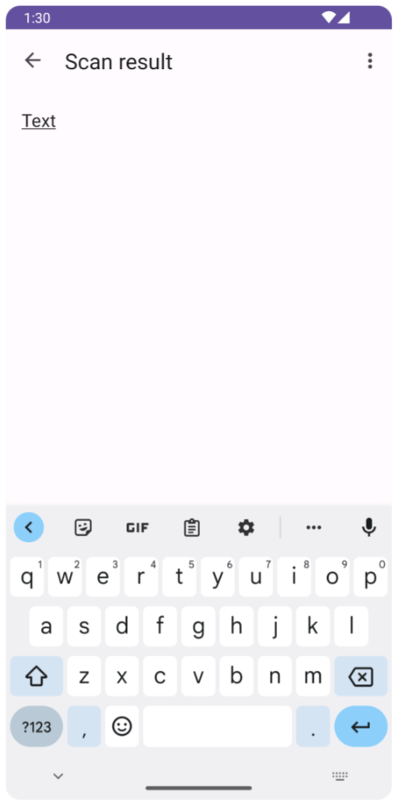
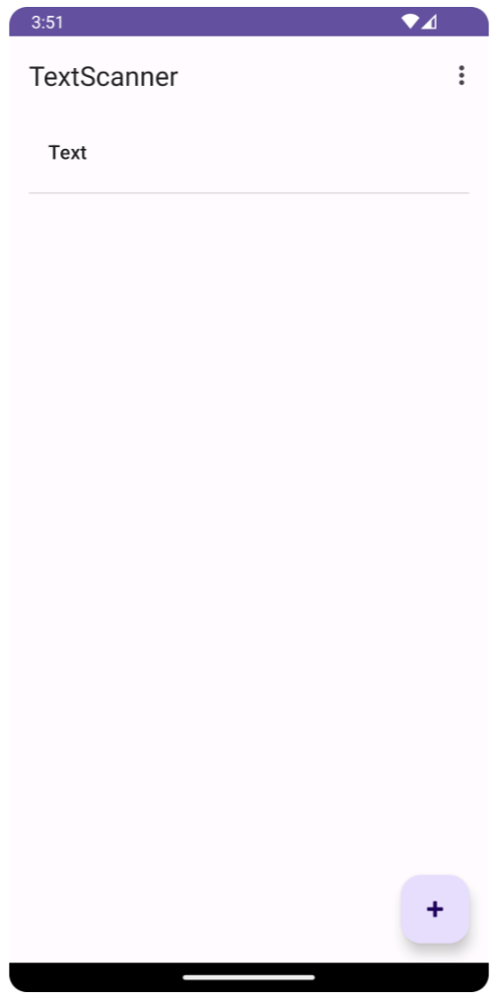
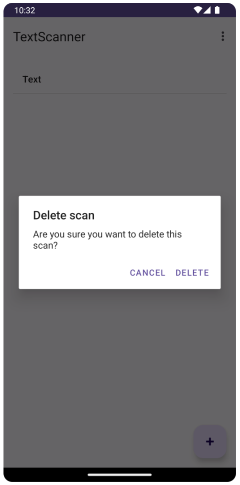

# TextScanner
Simple OCR text scanner application for Android using Google [ML Kit](https://developers.google.com/ml-kit).

Basic GUI implemented in order to experiment with and demo an application using Google's ML Kit.

  
  
  
  
  

